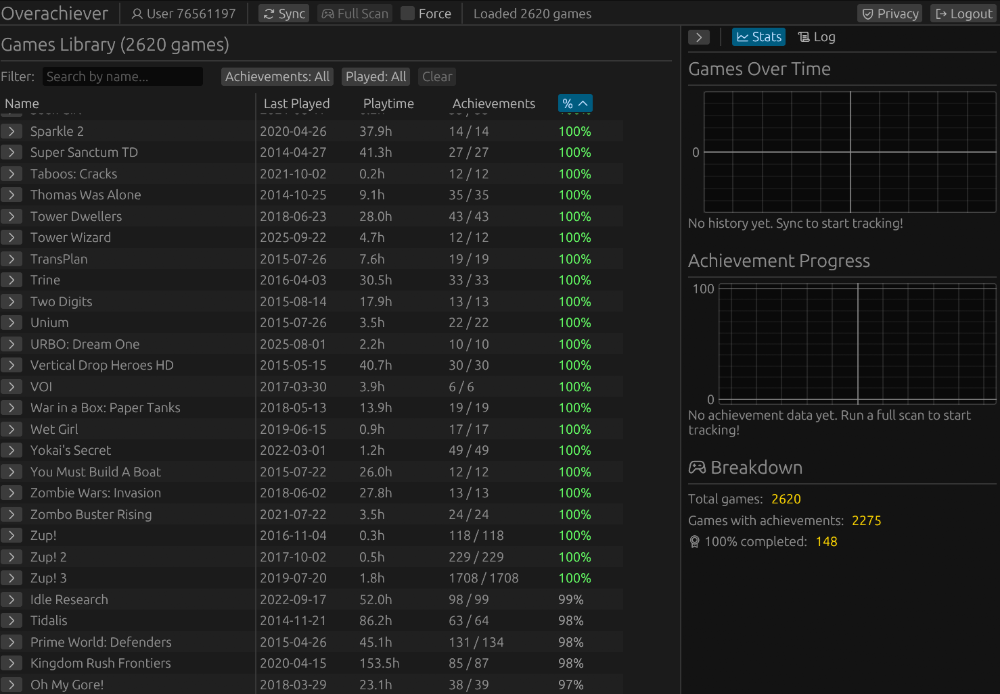

# Overachiever - Achievement Progress Tracker for Steam Games

An application for tracking your Steam game library and achievement progress over time. 

### Screenshot



Demo: https://overachiever.space

This project is not affiliated with steam or endorsed by Valve Corporation in any way or form.


## Setup
For this to work locally, you need to provide your Steam API key and Steam ID. You can configure these in the app by clicking the ⚙ (settings) button in the top-right corner.

To get a Steam API key, visit [Steam Web API Key](https://steamcommunity.com/dev/apikey) and register (free).

Your Steam ID is a 17-digit number. You can find it by visiting your Steam profile and looking at the URL, or use a site like [steamid.io](https://steamid.io/) or [steamidcheck.com](https://steamidcheck.com).

Configuration is stored in `config.toml` in the same directory as the executable.


## Building
Make sure you have [Rust](https://rust-lang.org/tools/install/) installed. Then, run:

```bash
cargo run --release
```
or 
```bash
cargo build --release
```

## Philosophy: REST/WebSocket Hybrid

This project uses a hybrid approach for client-server communication:

**WebSocket** is used for:
- Real-time data synchronization (game lists, achievement updates)
- Server-initiated pushes (scan progress, live updates)

**REST** is used for:
- User-initiated actions (submitting ratings, comments)
- One-off requests that don't need persistent connections


## Contributing
Contributions are welcome. Make a PR or open an issue. 
About half of the code has been "vibe-coded", feel free to help clean-up any mess. AI contributions are welcome, but at least do some low effort testing before submitting a PR. Thanks!

## Roadmap
Feel free to open an issue with suggestions.
- [ ] WASM version has lots of duplicated code with desktop version (AI, am I right?) Refactor plz.
- [ ] Improve the graphs.
- [ ] backend for comments ratings on achievements. 
- [ ] help users find easy achievements (need more data first?).
- [ ] Optimization: Pack icon files into single binary blob/texture atlas to reduce file count. Option to not cache icons to disk for desktop.
- [ ] Feature: export of achievement data.
- [ ] (important for the future!!): If we ever get a few more users, and more than one user scans at the same time, we will hit rate limits. We should implement some kind of queue. And run a backend service to handle requests. -- Currently if you leave the app, requests will stop, but the backend could keep going. its also a security problem to let the client trigger requests indescriminately. 
- [ ] Explain how data is stored and sent, and what steam openid is used for. (its kinda broken still)

## License
This project is licensed under the MIT License. See the `LICENSE` file for details.

## Acknowledgements
This project is in no way affiliated with or endorsed by Valve Corporation.